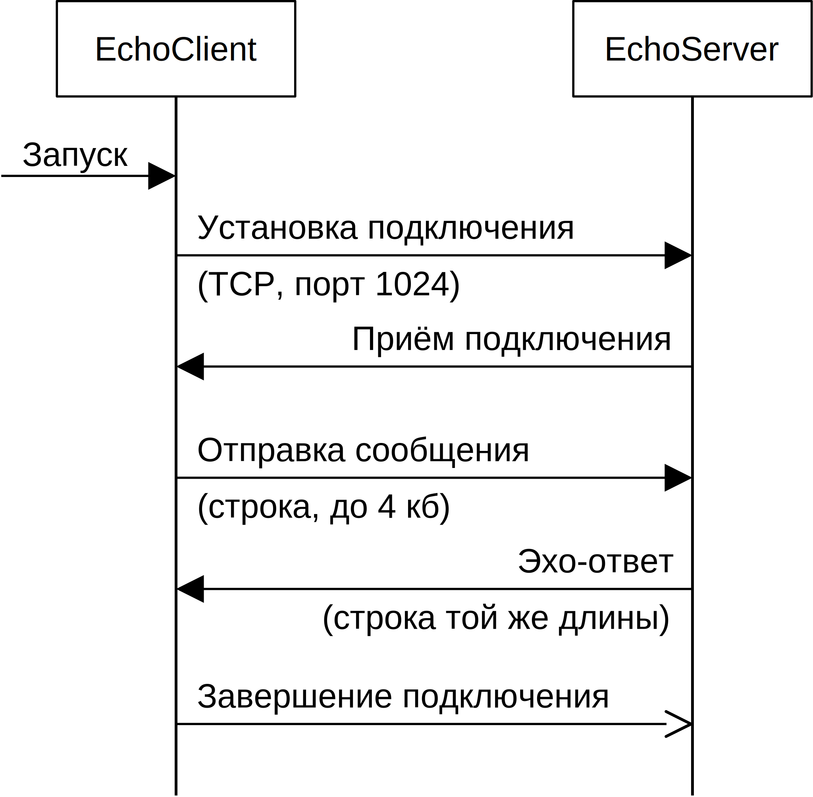

# Реализация эхо-приложения на основе процессов
При подключении клиента эхо-сервер порождает новый процесс-потомок для работы с этим клиентом.

## Протокол пользовательского уровня
UML-диаграмма протокола пользовательского уровня представлена на рисунке ниже.


## Описание работы приложения
Эхо-сервер `multiprocess-echo-server` ждёт подключение клиента по протоколу TCP на заданный порт (по умолчанию 1024).
После установки соединения сервер ожидает получения сообщения от клиента.
Каждое полученное сообщение сервер отсылает обратно приславшему это сообщение клиенту.

Клиент `client` подключается к эхо-серверу по заданному адресу, после чего считывает строку символов со стандартного ввода, отправляет считанные данные серверу и ждёт от него ответа.
Клиент повторяет чтение, отправку и получение данных заданной число раз, после чего завершает работу.

### Запуск сервера
Приложение эхо-сервера при запуске принимает два необязательных ключа `-h` и `-p` с параметрами, которые задают сетевой адрес (название хоста и номер порта соответственно) для связывания сокета.
```bash
./echo-server -h localhost -p 1024
```
По умолчанию сокет сервера связывается с адресом `localhost:1024`.
Завершения работы сервера — `Ctrl+C`.

### Запуск клиента
Приложение клиента при запуске принимает три необязательных ключа `-h`, `-p`  и `-n` с параметрами.
Ключи `-h` и `-p` задают сетевой адрес (название хоста и номер порта соответственно) сервера для подключения.
Ключ `-n` задаёт, сколько раз клиент будет пытаться считать данные для отправки серверу.
```bash
./client -h localhost -p 1024 -n 1
```
По умолчанию клиент пытается подключиться к адресу `localhost:1024`.

### "Стресс-тест" сервера
Скрипт `server-test.sh` позволяет запустить на компьютере заданное число клиентов для подключения к серверу и проверки его производительности.
Скрипт необходимо запускать в корневой папке проекта, в качестве аргумента необходимо передать путь к приложению клиента, например: `sh server-test.sh build/client`.
*Внимание!*
Реальную проверку производительности необходимо выполнять на двух компьютерах по локальной сети (сервер на одном, клиенты - на другом), после сборки сервера в режиме релиза и *отключения вывода на экран всех сообщений, кроме информации об ошибках*!
